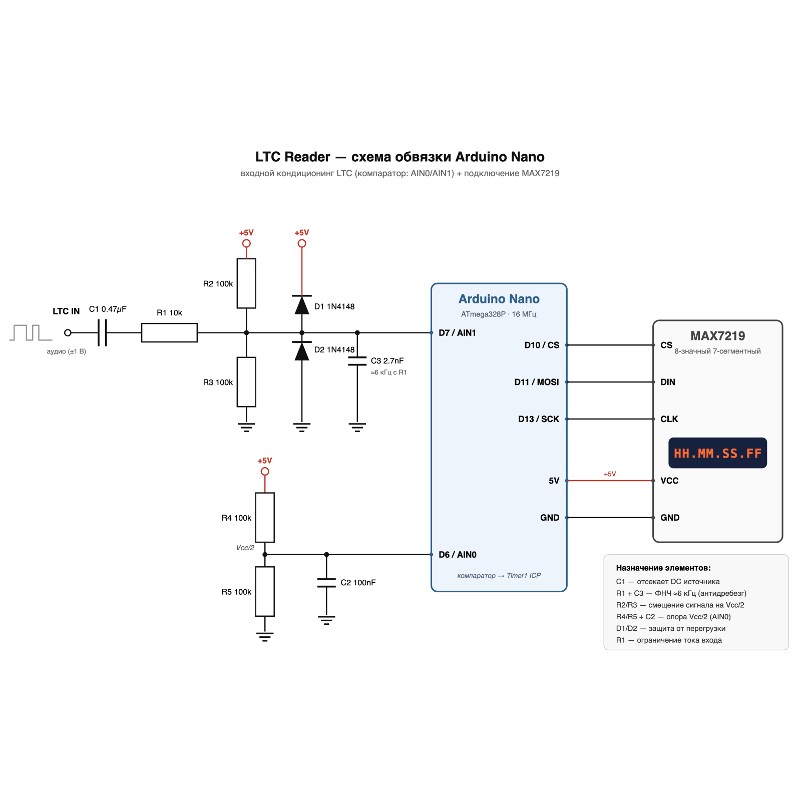

# LTC Reader Nano

Декодер **SMPTE LTC (Linear Timecode)** на **Arduino Nano** (ATmega328P) с выводом
таймкода `HH.MM.SS.FF` на 8-разрядный 7-сегментный индикатор **MAX7219**.

Сигнал захватывается аппаратно: аналоговый компаратор ATmega328P → **Timer1 Input
Capture**. Весь декодер написан на C++ **без внешних библиотек** (используется
только встроенная `SPI`). Flash ~3 КБ, RAM ~215 Б.

```
Аудио LTC ──► обвязка (Vcc/2 + ФНЧ) ──► D7/AIN1 ──► компаратор ──► Timer1 ICP
                                                                      │
                              ISR ──► кольцевой буфер меток фронтов ──┘
                                                                      │
                     loop(): bi-phase mark → 80-битный кадр → BCD HH:MM:SS:FF
                                                                      │
                                                        MAX7219 (SPI) ─┘  HH.MM.SS.FF
```

---

## Содержание

- [Возможности](#возможности)
- [Как работает LTC](#как-работает-ltc)
- [Аппаратная часть](#аппаратная-часть)
- [Сборка и прошивка](#сборка-и-прошивка)
- [Использование](#использование)
- [Архитектура ПО](#архитектура-по)
- [Особенности и инженерные решения](#особенности-и-инженерные-решения)
- [Инструменты](#инструменты)
- [Тестирование](#тестирование)
- [Диагностика (DEBUG)](#диагностика-debug)
- [Структура репозитория](#структура-репозитория)
- [Ограничения и известные особенности](#ограничения-и-известные-особенности)
- [Лицензия и референсы](#лицензия-и-референсы)

---

## Возможности

- Декодирование LTC по **bi-phase mark**, кадр 80 бит.
- **Автоопределение частоты кадров**: 24 / 25 / 30 fps (29.97 NDF → 30, флаг
  `drop frame` читается из бита кадра).
- Вывод полного таймкода `HH.MM.SS.FF`; разделители — десятичные точки.
- **Аппаратный тайминг** с разрешением 0.5 мкс (Timer1, prescaler 8); нагрузка на
  CPU ~1–2 % (худший случай — 4800 фронтов/с).
- **Адаптивный порог** «короткий/длинный» интервал (скользящее среднее) —
  терпимость к varispeed ~0.5–2×.
- Антидребезг 80 мкс в ПО + аппаратный noise canceller `ICNC1`.
- **Фильтр правдоподобия**: одиночный сбойный кадр (валидный по BCD, но с чужим
  таймкодом) не попадает на индикатор.
- **Устойчивость к паузам/перезапуску сигнала**: сброс фазы декодера при разрыве
  и сторож с мягким ре-инитом (см. ниже).
- Индикация потери сигнала — мигание последним таймкодом.
- Опциональный **диагностический UART-лог** (`#define DEBUG`), разбирается
  скриптом из `tools/`.

## Как работает LTC

LTC (SMPTE 12M) — таймкод, закодированный в аудио методом **bi-phase mark**
(разновидность манчестерского кодирования):

- **80 бит на кадр**; битовая скорость = `fps × 80`.
- Переход сигнала есть **в начале каждого битового интервала**; бит **«1»** —
  дополнительный переход **в середине** интервала, бит **«0»** — без него.
- Кадр завершается **sync word `0011111111111101`** (биты 64–79) — единственное
  место в потоке с длинной серией единиц; по нему находится граница кадра.
- Полезные данные — **`HH:MM:SS:FF` в BCD** + 32 бита user bits + флаги
  (drop frame и др.).

### Тайминги по стандартам

| Параметр                | 24 fps     | 25 fps (EBU)   | 29.97 / 30 fps    |
|-------------------------|------------|----------------|-------------------|
| Битовая скорость        | 1920 бит/с | 2000 бит/с     | 2397.6 / 2400 бит/с |
| Длительность бита       | 520.8 мкс  | 500 мкс        | 417 мкс           |
| Длительность полбита    | 260.4 мкс  | 250 мкс        | 208.3 мкс         |
| Период кадра            | 41.7 мс    | 40 мс          | 33.3 мс           |
| Макс. частота в сигнале | ~3.8 кГц   | ~4 кГц         | ~4.8 кГц          |

Уровень входного сигнала: профессиональный `+4 dBu` (~3.5 Vpp) или
потребительский `−10 dBV` (~0.6 Vpp). Детектору переходов через ноль достаточно
~100 мВ.

### Карта бит кадра (SMPTE 12M, LSB-first)

Сверено с `libltc`: user bits вклиниваются между нибблами времени, поэтому
**десятки** каждого BCD-поля лежат в **следующем** байте, а не в старшем ниббле
своего.

```
биты 0–3    кадры, единицы (BCD)
биты 4–7    user bits (UB1)
биты 8–9    кадры, десятки (BCD)
бит  10     флаг drop frame
бит  11     флаг color frame
биты 12–15  user bits (UB2)
биты 16–19  секунды, единицы (BCD)
биты 20–23  user bits (UB3)
биты 24–26  секунды, десятки (BCD)
бит  27     polarity correction
биты 28–31  user bits (UB4)
биты 32–35  минуты, единицы (BCD)
биты 36–39  user bits (UB5)
биты 40–42  минуты, десятки (BCD)
бит  43     BGF0
биты 44–47  user bits (UB6)
биты 48–51  часы, единицы (BCD)
биты 52–55  user bits (UB7)
биты 56–57  часы, десятки (BCD)
бит  58     BGF1
бит  59     BGF2
биты 60–63  user bits (UB8)
биты 64–79  sync word 0011111111111101 (0x3FFD)
```

## Аппаратная часть

### Распределение пинов Nano

| Пин         | Назначение                                     |
|-------------|------------------------------------------------|
| D7 (AIN1)   | Вход LTC (смещённый на Vcc/2)                  |
| D6 (AIN0)   | Опора Vcc/2 (делитель + bypass-конденсатор)    |
| D11 (MOSI)  | MAX7219 DIN (аппаратный SPI)                   |
| D13 (SCK)   | MAX7219 CLK                                    |
| D10 (CS)    | MAX7219 LOAD/CS                                |
| D8, D9, D12 | Свободны                                       |

> Захват фронтов идёт **внутри** МК через бит `ACIC` (выход компаратора →
> Input Capture), поэтому пин ICP1 (D8) **не используется**.

### Схема обвязки



Исходник схемы — [`scheme.svg`](scheme.svg).

```
Аудио вход ── C1 0.47uF ── R1 10k ──┬──► D7 (AIN1)
                                     │
                             R2 100k ┴ R3 100k   (смещение на Vcc/2)
                                     │
                                    GND / +5V
                                     │
                             C3 2.7nF ── GND      (ФНЧ ≈6 кГц с R1)

       +5V ── R4 100k ─┬─ R5 100k ── GND          (опора Vcc/2)
                       ├──► D6 (AIN0)
                       └── C2 100nF ── GND         (bypass)
```

- **C1** — отсекает DC источника.
- **R1 + C3** — ФНЧ ≈6 кГц (срез выше макс. частоты сигнала 4.8 кГц).
- **R2/R3** — смещение входа на Vcc/2.
- **R4/R5 + C2** — опора Vcc/2 на AIN0.
- **D1/D2** — защитные диоды 1N4148 на Vcc и GND.
- **R1** — ограничение тока во вход.

### Компоненты (BOM)

| Кол-во | Компонент                                        |
|--------|--------------------------------------------------|
| 1      | Arduino Nano (ATmega328P, 16 МГц)                |
| 1      | Модуль MAX7219, **8 цифр 7-сегментных** (не 8×8 матрица!) |
| 4      | Резистор 100 кОм (R2, R3, R4, R5)                |
| 1      | Резистор 10 кОм (R1)                             |
| 1      | Конденсатор 0.47 мкФ (C1)                        |
| 1      | Конденсатор 100 нФ (C2)                          |
| 1      | Конденсатор 2.7 нФ (C3)                          |
| 2      | Диод 1N4148 (D1, D2)                             |

## Сборка и прошивка

### Требования

- Arduino IDE (с поддержкой плат **Arduino AVR Boards**) **или** `arduino-cli`.
- Ядро: `arduino:avr` (плата `arduino:avr:nano`).
- Для прошивки через ISP — программатор (например, USBasp) и `avrdude`.

### Вариант 1 — Arduino IDE

1. Открыть `ltc_reader_nano/ltc_reader_nano.ino`.
2. Плата: **Arduino Nano**; процессор: **ATmega328P** (или *ATmega328P (Old
   Bootloader)* для старых клонов).
3. Для отладки при необходимости выставить `#define DEBUG 1`.
4. **Проверить → Загрузка** (обычная загрузка через bootloader).

### Вариант 2 — arduino-cli

```bash
arduino-cli core install arduino:avr
arduino-cli compile --fqbn arduino:avr:nano ltc_reader_nano
```

Для сборки `hex` в отдельный каталог:

```bash
arduino-cli compile --fqbn arduino:avr:nano --output-dir build ltc_reader_nano
```

### Прошивка через ISP

Если bootloader отсутствует/не работает — прошивать напрямую:

```bash
# USBasp, ATmega328P
avrdude -c usbasp -p m328p -U flash:w:build/ltc_reader_nano.ino.hex:i
```

> Учтите: после прошивки через ISP fuse-биты не трогаются, но при «затирании»
> bootloader его нужно вернуть отдельно, если планируется загрузка по USB.

### Размер сборки

| Конфигурация       | Flash         | RAM           |
|--------------------|---------------|---------------|
| `DEBUG 0` (релиз)  | 2986 Б (9 %)  | 215 Б (10 %)  |
| `DEBUG 1` (лог)    | 5168 Б (16 %) | 412 Б (20 %)  |

## Использование

1. Подать сигнал LTC (аудио) на вход обвязки (см. схему).
2. Включить питание. На индикаторе на время инициализации — `--------`.
3. После появления валидного кадра индикатор покажет `HH.MM.SS.FF`.
   Точки-разделители стоят после часов, минут и секунд.
4. При потере сигнала >500 мс индикатор начинает мигать последним таймкодом;
   при возврате сигнала — снова показывает текущий.

## Архитектура ПО

Один файл, блоки 1–9 (см. также [`PLAN.md`](PLAN.md) §6):

| #   | Блок                | Роль                                                         |
|-----|---------------------|--------------------------------------------------------------|
| 1   | Константы           | Пины, sync word, пороги, размеры буферов                     |
| 2   | Глобальное состояние| Кольцевой буфер, сдвиговый регистр, `TimeCode`, fps           |
| 3   | `setup()`           | SPI + MAX7219, Timer1 + компаратор                           |
| 4   | `ISR(TIMER1_CAPT)`  | Захват метки фронта `ICR1`, toggle `ICES1` (оба фронта)      |
| 5   | Декодер bi-phase    | Классификация интервалов, 80-битный сдвиг, детектор sync     |
| 6   | Парсер BCD          | Разбор карты бит, валидация диапазонов                       |
| 6b  | Фильтр правдоподобия| Отсев одиночных сбойных кадров, (ре)захват                   |
| 7   | Авто-fps            | Период между sync words → 24/25/30                            |
| 7b  | Сторож              | Мягкий ре-инит декодера при залипании                        |
| 8   | Драйвер MAX7219     | Прямой SPI, `renderTC()`, мигание                            |
| 9   | `loop()`            | Декодирование, разрыв, сторож, парсинг, вывод, лог            |

### Поток данных

```
ISR(TIMER1_CAPT) ──► edgeBuf[64] (uint16_t, кольцо, head/tail)
        │
loop → processEdges():
        │   delta = now − lastEdge        (беззнаковая, переполнение Timer1 не страшно)
        │   delta < 80 мкс      → дребезг, игнор
        │   delta < thrShort    → полбита; два подряд → бит «1»
        │   иначе (длинный)     → бит «0»
        │   EMA обновляет shortAvg/longAvg → thrShort = (shortAvg+longAvg)/2
        ▼
   shiftBit() ──► frameBits[10] (80 бит)
        │   frameBits[8]==0xFC && frameBits[9]==0xBF → кадр полный
        ▼
   parseFrame() ──► BCD → HH:MM:SS:FF (+ DF), проверка диапазонов
        │
   tcPlausible() ──► монотонность / (ре)захват
        ▼
   renderTC() ──► MAX7219
```

### Тайминг и буферизация

- **Timer1**: prescaler 8 → тик **0.5 мкс**; включены `ICNC1` (noise canceller,
  4 сэмпла) и `ICES1` (старт — восходящий фронт).
- **ACIC=1** — выход аналогового компаратора аппаратно заведён на Input Capture;
  прерывание компаратора (`ACIE`) не используется.
- **DIDR1** — цифровые буферы `AIN0`/`AIN1` отключены.
- **Кольцевой буфер** на 64 записи (степень двойки, индекс по маске). ISR только
  пишет метку и переключает фронт; разбор — в `loop()`. Переполнение Timer1
  безопасно: интервалы < 600 мкс, беззнаковая разность корректна.
- **SPI**: 4 МГц (`SPISettings`), `transfer16(reg<<8 | val)`; CS — D10.

## Особенности и инженерные решения

- **Почему компаратор + Input Capture**, а не ADC/библиотеки на `CHANGE`:
  аппаратный тайминг с точностью 0.5 мкс, минимальная нагрузка на CPU,
  помехоустойчивость (`ICNC1`). `micros()` дал бы джиттер прерываний 4 мкс.
- **Адаптивный порог** «короткий/длинный»: EMA 1/4 по каждому классу,
  `thrShort = (shortAvg + longAvg) / 2` (~0.75 битового периода). Позволяет
  декодировать сигнал с varispeed.
- **Авто-fps по периоду кадра**: EMA интервалов между sync words (замер в
  `micros()`), классификация после 8 кадров: `>40.8 мс → 24`, `>36 мс → 25`,
  иначе `30`. Двойной интервал (потеря sync) отсеивается, смена скорости — после
  `FPS_HYST=4` подряд классификаций в пользу нового значения.
  29.97 и 30 по периоду неразличимы (33.367 vs 33.333 мс) — оба дают `fps=30`,
  а признак drop frame берётся из бита кадра (`tc.drop`).
- **Фильтр правдоподобия** (блок 6b): пара «лишний/потерянный фронт» даёт
  одиночную битовую ошибку — кадр остаётся валидным по BCD, но время в нём чужое.
  Такой кадр не показывается. Настоящие смены источника проходят: (ре)захват
  после потери сигнала >500 мс или смены fps, а устойчиво «другой» ряд кадров
  принимается после 8 подряд отклонений.
- **Ресинк после паузы** (блок 9, п. 1b): при отсутствии фронтов >5 мс фаза
  сбрасывается (`haveEdge=false`). Иначе первый фронт после паузы даёт огромный
  интервал → фантомный бит → сдвиг потока на 1 бит и порча адаптивных порогов;
  sync находится, но кадры «съезжают», и дисплей навсегда замирает.
- **Сторож декодера** (блок 7b): если сигнал идёт (фронты свежие), а валидных
  кадров нет >400 мс — мягкий ре-инит порогов и фазы (аналог Reset без сброса
  железа). Лечит залипание адаптивных порогов после переходных процессов/шума на
  входе в тишине.
- **Без внешних библиотек**: только `SPI`, `avr/io.h`, `avr/interrupt.h`.
  MAX7219 использует встроенный **Code B** (аппаратная дешифровка цифр), поэтому
  таблица шрифтов не нужна, а десятичная точка — это бит 7 значения разряда.
- **Низкая яркость** MAX7219 (`intensity=0x03`) — меньше импульсных токов и
  наводок на вход (актуально для макетного стенда).

## Инструменты

Каталог [`tools/`](tools/) — утилиты разработки (Python 3):

| Файл                 | Назначение                                                        |
|----------------------|-------------------------------------------------------------------|
| `ltc_wav_check.py`   | Оффлайн-проверка логики декодера на WAV: переходы через ноль → интервалы → bi-phase → sync → BCD; проверка монотонности. Авто-детект битрейта 25/24/30. |
| `probe_reset.py`     | Захват UART с платы после DTR-сброса (raw termios).                |
| `analyze_capture.py` | Разбор UART-лога: D-строки, TC-строки, авто-диагноз вход/декодера. |
| `uart_probe.sh`      | Альтернативный захват через `stty`+`cat` (менее надёжен).          |

Порт задаётся переменной окружения `LTC_PORT` (по умолчанию
`/dev/cu.usbserial-A5069RR4`):

```bash
export LTC_PORT=/dev/ttyUSB0
```

### Проверка декодера на WAV

```bash
python3 tools/ltc_wav_check.py LTC_01000000_5mins_25_FPS_48000x16.wav
```

Ожидаемый вывод: найден sync, первый кадр, `разрывов последовательности: 0`.

### Снятие и разбор UART-лога

```bash
# 1) собрать и прошить скетч с #define DEBUG 1
# 2) захват (пауза 10–15 с, затем resume — чтобы поймать восстановление)
LTC_PORT=/dev/cu.usbserial-A5069RR4 python3 tools/probe_reset.py 115200 40 /tmp/cap.txt
# 3) разбор
python3 tools/analyze_capture.py /tmp/cap.txt
```

## Тестирование

### Эталонные WAV

Логика декодера проверялась на трёх 5-минутных файлах LTC (48 кГц, 16 бит):

| Файл                                      | fps  |
|-------------------------------------------|------|
| `LTC_01000000_5mins_25_FPS_48000x16.wav`  | 25   |
| `LTC_02000000_5mins_24_FPS_48000x16.wav`  | 24   |
| `LTC_03000000_5mins_30_NDF_FPS_48000x16.wav` | 30 (NDF) |

> Файлы **не хранятся в репозитории** (≈29 МБ каждый). Сгенерируйте их
> генератором LTC (например, [elteesee](https://elteesee.pehrhovey.net/)):
> длительность 5 мин, частота 48 кГц, 16 бит, соответствующий fps. Имена файлов
> сохраните как в таблице — на них рассчитаны команды выше.

### Что проверялось

- Все три fps (24 / 25 / 30), в т.ч. 30 NDF.
- Корректность карты бит (десятки BCD) — сверено с `libltc` и на WAV.
- Монотонность декодированного таймкода (`+1` кадр, 0 разрывов).
- Восстановление после паузы/перезапуска сигнала (сброс фазы + сторож).

## Диагностика (DEBUG)

При `#define DEBUG 1` раз в секунду печатается D-строка, а на каждый валидный
кадр — TC-строка:

```
D E=2365 deb=0 S=886 L=1479 sync=24 rej=0 flt=0 gap=0 thr=785 raw=...
TC 01:00:12:01 fps=25
```

| Поле    | Значение                                                        |
|---------|-----------------------------------------------------------------|
| `E`     | фронтов вычитано из буфера за секунду                            |
| `deb`   | отброшено антидребезгом                                          |
| `S`/`L` | коротких / длинных интервалов                                    |
| `sync`  | совпадений sync word                                             |
| `rej`   | кадров найдено, но `parseFrame` отверг (BCD/диапазон)            |
| `flt`   | отклонено фильтром правдоподобия (валидный, но чужой TC)         |
| `gap`   | сбросов фазы (разрыв сигнала)                                    |
| `thr`   | текущий адаптивный порог, тики (0.5 мкс)                         |
| `raw`   | сырые 10 байт последнего кадра (hex)                             |

Ориентиры для здорового входа (24 fps): `E≈2365`, `deb≈0`, `S≈886`, `L≈1479`,
`sync≈24`, `rej≈0`, `flt≈0`, `gap≈0`, `thr≈781–790`. Строка `REINIT` в логе
означает срабатывание сторожа (блок 7b).

`analyze_capture.py` считает min/avg/max по полям и печатает авто-диагноз
(нет сигнала / лишние фронты / дребезг / сбой декодера и т.п.).

## Структура репозитория

```
.
├── ltc_reader_nano/
│   └── ltc_reader_nano.ino      # основной скетч (блоки 1–9)
├── max7219_test/
│   └── max7219_test.ino         # тест 8-разрядного индикатора MAX7219
├── tools/
│   ├── ltc_wav_check.py         # проверка декодера на WAV
│   ├── probe_reset.py           # захват UART после DTR-сброса
│   ├── analyze_capture.py       # разбор UART-лога + авто-диагноз
│   └── uart_probe.sh            # альтернативный захват (stty+cat)
├── scheme.svg                   # схема обвязки (исходник)
├── scheme.svg.png               # схема обвязки (растр)
├── PLAN.md                      # проектный план, решения, карта бит
├── DEBUG_STATUS.md              # журнал отладки на стенде
├── LICENSE                      # MIT
└── README.md
```

## Ограничения и известные особенности

- **29.97 DF vs 30 NDF** по периоду кадра неразличимы; drop frame определяется по
  биту кадра, а не по частоте.
- **Порядок разрядов MAX7219** в `renderTC()` инвертирован (`d[0]` → reg8) под
  конкретный стендовый модуль, где регистр 1 — крайний правый. На модуле с другим
  порядком разрядов вывод будет зеркальным — поменяйте индекс в `renderTC()`.
- **Очень слабый вход** (<~50 мВ) не декодируется — нужен внешний усилитель.
- Модуль индикатора должен быть **7-сегментным** (8 цифр), а не 8×8-матрицей.

## Лицензия и референсы

Лицензия — **MIT** (см. [`LICENSE`](LICENSE)).

Референсы:

- **ltc_reader** — https://github.com/0x664b44c3/ltc_reader — лёгкий LTC-декодер
  для AVR (компаратор + ICP), та же архитектура. Главный референс.
- **libltc** (x42 / Robin Gareus) — https://github.com/x42/libltc — эталонная
  библиотека; использовалась для сверки раскладки бит SMPTE 12M.
- **LTC-LinearTimecode-SMPTE** (CppPlayground) —
  https://github.com/CppPlayground/LTC-LinearTimecode-SMPTE — Arduino-библиотека
  на `CHANGE`-прерываниях.
- Спецификация SMPTE 12M; описание —
  https://en.wikipedia.org/wiki/Linear_timecode
- Генератор тестовых LTC-WAV — https://elteesee.pehrhovey.net/
